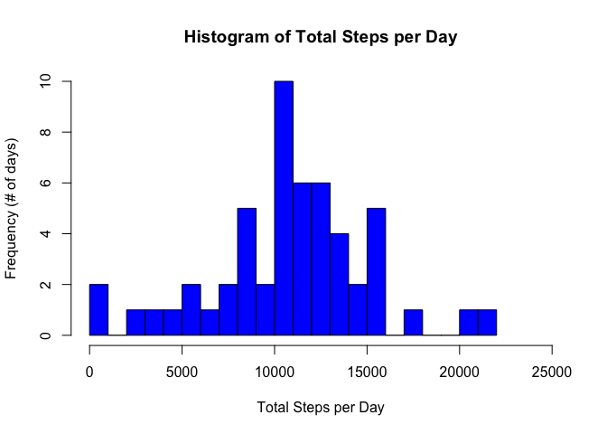
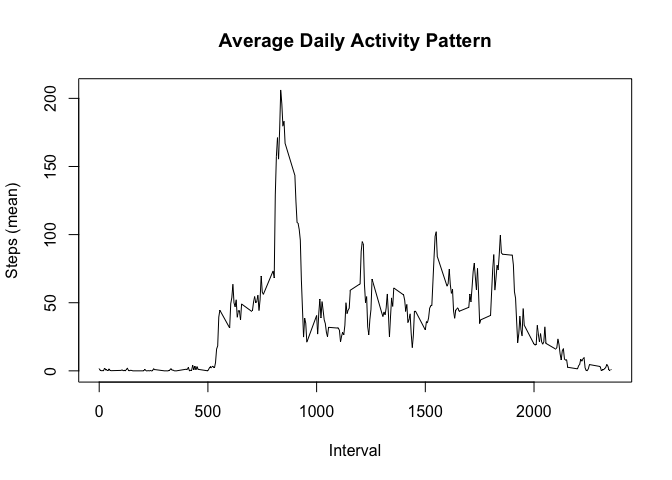
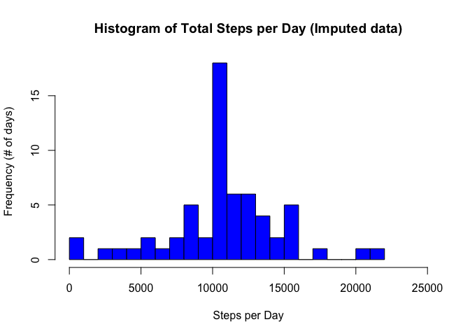
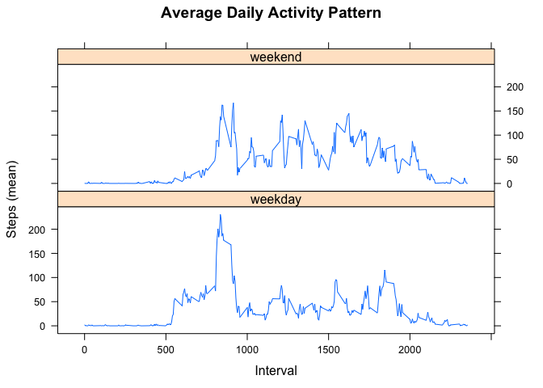

## Loading and preprocessing the data

##### 1. Load the data (i.e. read.csv()).  

```r
activity<-read.csv("activity.csv")
```

##### 2. Process/transform the data (if necessary) into a format suitable for your analysis.  
  
The class of the date column should be changed from from "character" to "date."   

```r
activity$date<-as.Date(activity$date, "%Y-%m-%d")
```

## What is mean total number of steps taken per day?

##### 1. Calculate the total number of steps taken per day.  

```r
stepsperday<-aggregate(steps~date, activity, sum, na.action=na.omit)
print(stepsperday)
```

```
##          date steps
## 1  2012-10-02   126
## 2  2012-10-03 11352
## 3  2012-10-04 12116
## 4  2012-10-05 13294
## 5  2012-10-06 15420
## 6  2012-10-07 11015
## 7  2012-10-09 12811
## 8  2012-10-10  9900
## 9  2012-10-11 10304
## 10 2012-10-12 17382
## 11 2012-10-13 12426
## 12 2012-10-14 15098
## 13 2012-10-15 10139
## 14 2012-10-16 15084
## 15 2012-10-17 13452
## 16 2012-10-18 10056
## 17 2012-10-19 11829
## 18 2012-10-20 10395
## 19 2012-10-21  8821
## 20 2012-10-22 13460
## 21 2012-10-23  8918
## 22 2012-10-24  8355
## 23 2012-10-25  2492
## 24 2012-10-26  6778
## 25 2012-10-27 10119
## 26 2012-10-28 11458
## 27 2012-10-29  5018
## 28 2012-10-30  9819
## 29 2012-10-31 15414
## 30 2012-11-02 10600
## 31 2012-11-03 10571
## 32 2012-11-05 10439
## 33 2012-11-06  8334
## 34 2012-11-07 12883
## 35 2012-11-08  3219
## 36 2012-11-11 12608
## 37 2012-11-12 10765
## 38 2012-11-13  7336
## 39 2012-11-15    41
## 40 2012-11-16  5441
## 41 2012-11-17 14339
## 42 2012-11-18 15110
## 43 2012-11-19  8841
## 44 2012-11-20  4472
## 45 2012-11-21 12787
## 46 2012-11-22 20427
## 47 2012-11-23 21194
## 48 2012-11-24 14478
## 49 2012-11-25 11834
## 50 2012-11-26 11162
## 51 2012-11-27 13646
## 52 2012-11-28 10183
## 53 2012-11-29  7047
```
  
##### 2. If you do not understand the difference between a histogram and a barplot, research the difference between them. Make a histogram of the total number of steps taken each day.  

```r
hist(stepsperday$steps, main="Histogram of Total Steps per Day", xlab= "Total Steps per Day", ylab="Frequency (# of days)", col="blue", breaks=25, xlim=c(1,25000))
```

<!-- -->
  
##### 3. Calculate and report the mean and median of the total number of steps taken per day.  

```r
options(scipen=999)
mnsteps<-round(mean(stepsperday$steps),2)
```
  
The mean steps per day is `10766.19` steps. 

```r
medsteps<- median(stepsperday$steps)
```
  
The median steps per day is `10765` steps.  
  
## What is the average daily activity pattern?
  
##### 1. Make a time series plot (i.e. type = "l") of the 5-minute interval (x-axis) and the average number of steps taken, averaged across all days (y-axis).  

First, we need to calculate the mean number of steps taken during each interval, averaged across all days in the dataset.

```r
stepsperinterval<-aggregate(steps~interval, activity, mean, na.action=na.omit)
```

Then we can use this information to create a time series plot:

```r
plot(stepsperinterval$interval, stepsperinterval$steps, type = "l", main="Average Daily Activity Pattern", xlab="Interval", ylab= "Steps (mean)")
```

<!-- -->
  
##### 2. Which 5-minute interval, on average across all the days in the dataset, contains the maximum number of steps?


```r
maxinterval<-stepsperinterval[stepsperinterval$steps==max(stepsperinterval$steps),]$interval
```

The interval with the maximum number of steps, averaged across all days in the dataset, is interval `835`.  

## Imputing missing values
   
##### 1. Calculate and report the total number of missing values in the dataset (i.e. the total number of rows with NAs).


```r
data_missing<-sum(!complete.cases(activity))
```
There are `2304` rows with missing values in the dataset.
 
##### 2. Devise a strategy for filling in all of the missing values in the dataset. The strategy does not need to be sophisticated. For example, you could use the mean/median for that day, or the mean for that 5-minute interval, etc.  

We will impute the missing values (# of steps) by using the mean number of steps for that interval across all days in the dataset.  
  
##### 3. Create a new dataset that is equal to the original dataset but with the missing data filled in.  


```r
imputed_data<-activity
for (i in 1:nrow(imputed_data)) {
        if (is.na(imputed_data$steps[i])){
                missing_interval<-imputed_data$interval[i]
                imputed_value<-stepsperinterval[stepsperinterval$interval==missing_interval,]$steps
                imputed_data$steps[i]<-imputed_value
        }
}
```
The first ten rows of the original data set:  

```r
head(activity, 10)
```

```
##    steps       date interval
## 1     NA 2012-10-01        0
## 2     NA 2012-10-01        5
## 3     NA 2012-10-01       10
## 4     NA 2012-10-01       15
## 5     NA 2012-10-01       20
## 6     NA 2012-10-01       25
## 7     NA 2012-10-01       30
## 8     NA 2012-10-01       35
## 9     NA 2012-10-01       40
## 10    NA 2012-10-01       45
```
Compared to the first ten rows of the imputed data set (illustrating our code works to impute the data):

```r
head(imputed_data, 10)
```

```
##        steps       date interval
## 1  1.7169811 2012-10-01        0
## 2  0.3396226 2012-10-01        5
## 3  0.1320755 2012-10-01       10
## 4  0.1509434 2012-10-01       15
## 5  0.0754717 2012-10-01       20
## 6  2.0943396 2012-10-01       25
## 7  0.5283019 2012-10-01       30
## 8  0.8679245 2012-10-01       35
## 9  0.0000000 2012-10-01       40
## 10 1.4716981 2012-10-01       45
```
  
##### 4. Make a histogram of the total number of steps taken each day and calculate and report the mean and median total number of steps taken per day. Do these values differ from the estimates from the first part of the assignment? What is the impact of imputing missing data on the estimates of the total daily number of steps?
  
First we need to calculate the number of steps taken per day using the imputed data set:


```r
newsteps<-aggregate(steps~date, imputed_data, sum, na.action=na.omit)
print(newsteps)
```

```
##          date    steps
## 1  2012-10-01 10766.19
## 2  2012-10-02   126.00
## 3  2012-10-03 11352.00
## 4  2012-10-04 12116.00
## 5  2012-10-05 13294.00
## 6  2012-10-06 15420.00
## 7  2012-10-07 11015.00
## 8  2012-10-08 10766.19
## 9  2012-10-09 12811.00
## 10 2012-10-10  9900.00
## 11 2012-10-11 10304.00
## 12 2012-10-12 17382.00
## 13 2012-10-13 12426.00
## 14 2012-10-14 15098.00
## 15 2012-10-15 10139.00
## 16 2012-10-16 15084.00
## 17 2012-10-17 13452.00
## 18 2012-10-18 10056.00
## 19 2012-10-19 11829.00
## 20 2012-10-20 10395.00
## 21 2012-10-21  8821.00
## 22 2012-10-22 13460.00
## 23 2012-10-23  8918.00
## 24 2012-10-24  8355.00
## 25 2012-10-25  2492.00
## 26 2012-10-26  6778.00
## 27 2012-10-27 10119.00
## 28 2012-10-28 11458.00
## 29 2012-10-29  5018.00
## 30 2012-10-30  9819.00
## 31 2012-10-31 15414.00
## 32 2012-11-01 10766.19
## 33 2012-11-02 10600.00
## 34 2012-11-03 10571.00
## 35 2012-11-04 10766.19
## 36 2012-11-05 10439.00
## 37 2012-11-06  8334.00
## 38 2012-11-07 12883.00
## 39 2012-11-08  3219.00
## 40 2012-11-09 10766.19
## 41 2012-11-10 10766.19
## 42 2012-11-11 12608.00
## 43 2012-11-12 10765.00
## 44 2012-11-13  7336.00
## 45 2012-11-14 10766.19
## 46 2012-11-15    41.00
## 47 2012-11-16  5441.00
## 48 2012-11-17 14339.00
## 49 2012-11-18 15110.00
## 50 2012-11-19  8841.00
## 51 2012-11-20  4472.00
## 52 2012-11-21 12787.00
## 53 2012-11-22 20427.00
## 54 2012-11-23 21194.00
## 55 2012-11-24 14478.00
## 56 2012-11-25 11834.00
## 57 2012-11-26 11162.00
## 58 2012-11-27 13646.00
## 59 2012-11-28 10183.00
## 60 2012-11-29  7047.00
## 61 2012-11-30 10766.19
```

Then we can use this information to create an updated histogram:

```r
hist(newsteps$steps, main="Histogram of Total Steps per Day (Imputed data)", xlab= "Steps per Day", ylab="Frequency (# of days)", col="blue", breaks=25, xlim=c(1,25000))
```

<!-- -->

We can then recalculate the mean steps per day using the imputed data set.  

```r
mnstepsnew<-round(mean(newsteps$steps),2)
```
  
The mean steps per day, after imputation, is `10766.19` steps. This method of imputation does not change the mean number of steps per day.  
  
We can then recalculate the median steps per day using the imputed data set. 

```r
medstepsnew<- round(median(newsteps$steps),2)
meddiff<-medstepsnew-medsteps
```
  
The median steps per day, after imputation, is `10766.19` steps. This imputation method increases the median number of steps by `1.19` when compared to the raw data. 

## Are there differences in activity patterns between weekdays and weekends?

##### 1. Create a new factor variable in the dataset with two levels – “weekday” and “weekend” indicating whether a given date is a weekday or weekend day.  


```r
imputed_data$day_type<-ifelse(weekdays(imputed_data$date) %in% c("Saturday", "Sunday"), "weekend","weekday")
```

##### 2. Make a panel plot containing a time series plot (i.e. type = "l") of the 5-minute interval (x-axis) and the average number of steps taken, averaged across all weekday days or weekend days (y-axis). See the README file in the GitHub repository to see an example of what this plot should look like using simulated data.

First, we need to calculate the mean number of steps taken during each interval, segregated by type of day (weekday vs. weekend), averaged across all days of each type in the imputed dataset.

```r
newinterval<-aggregate(steps~interval+day_type, imputed_data, mean, na.action=na.omit)
```

Then we can use this information to create a time series panel plot:

```r
library(lattice)
xyplot(steps~interval | day_type, data=newinterval, type = "l", main="Average Daily Activity Pattern", xlab="Interval", ylab= "Steps (mean)", layout=c(1,2))
```

<!-- -->
